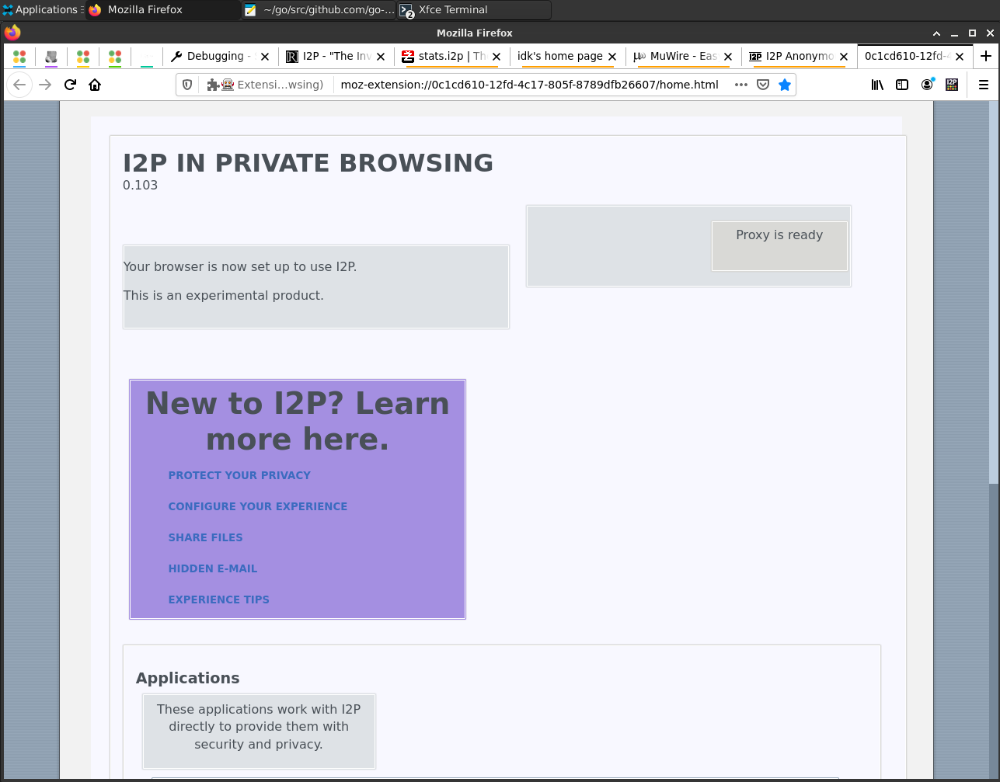
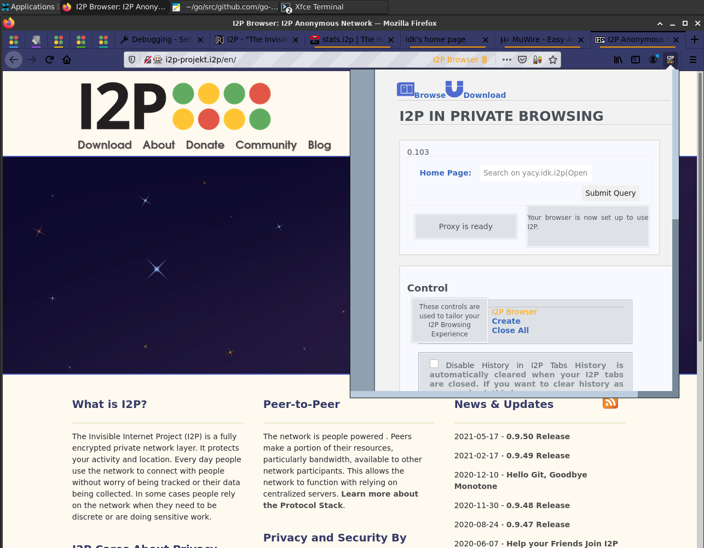
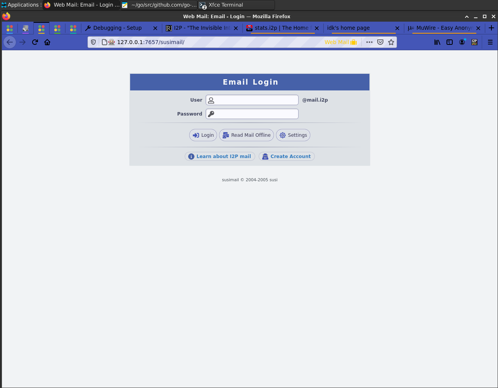
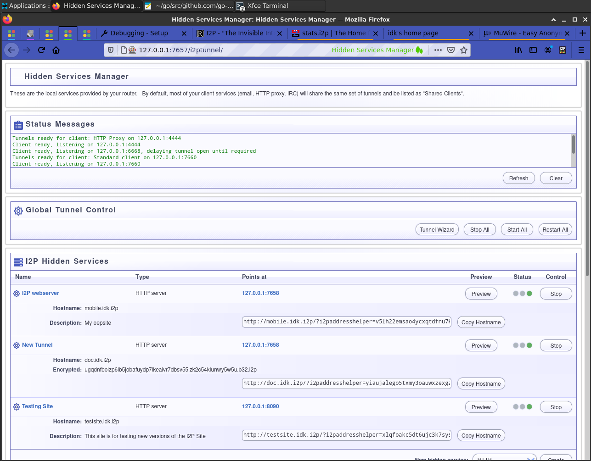
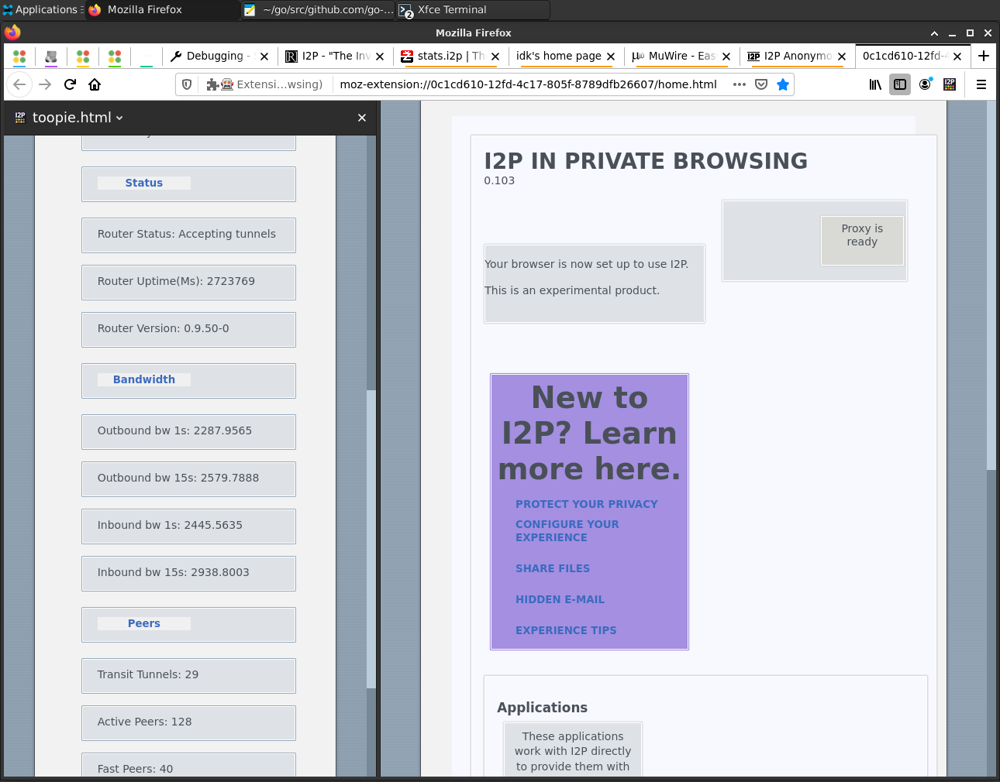
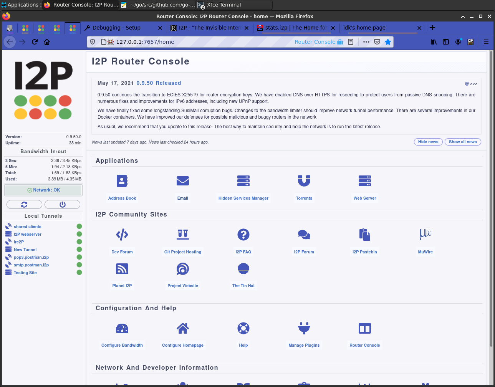
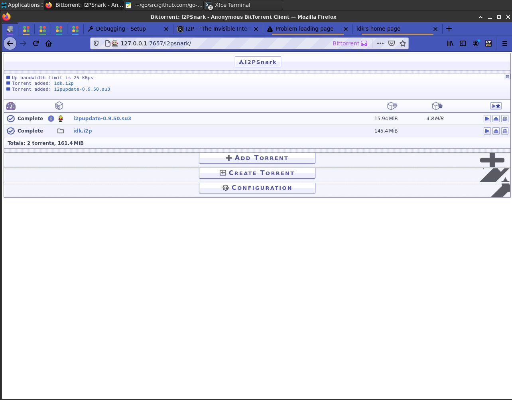
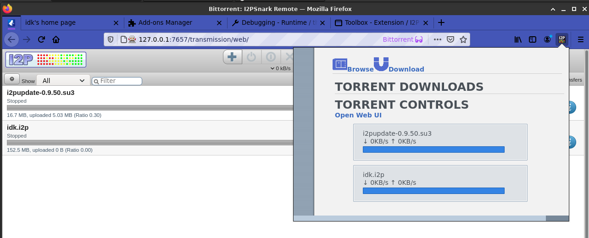
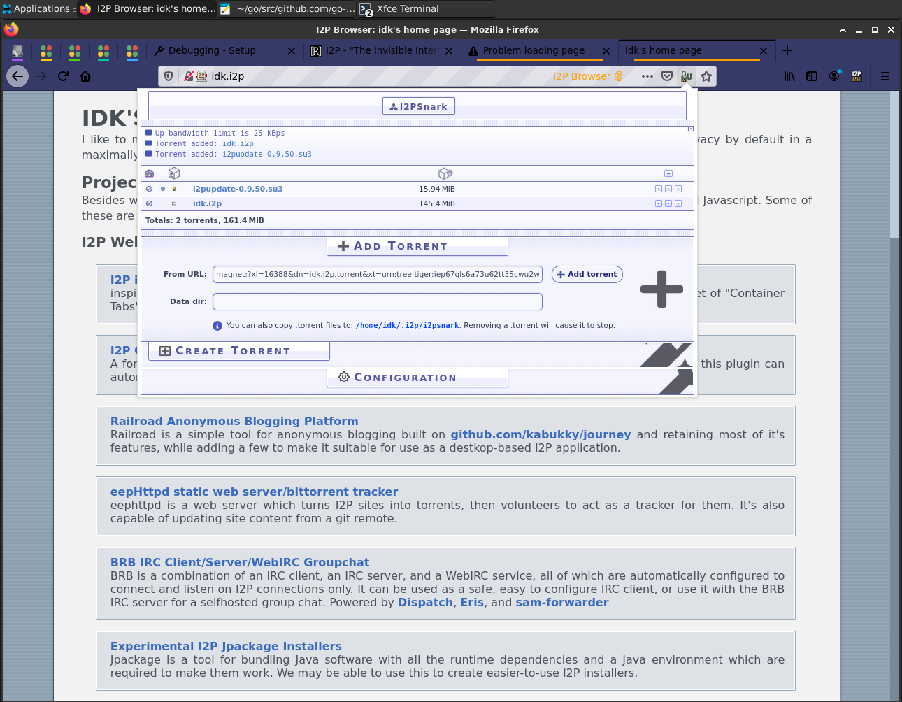
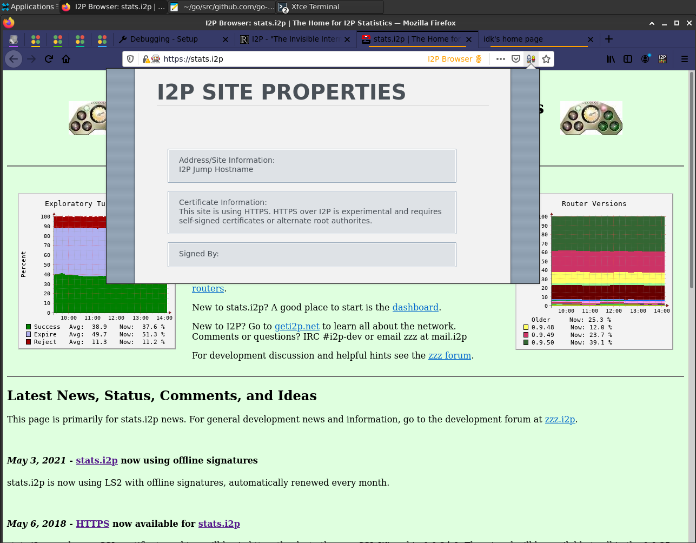

I2P in Private Browsing Mode(Firefox-Only)
==========================================

- **This extension requires a running I2P Router on the Host System**

- [**This extension comes pre-installed in the Easy-Install Beta for Windows**](https://geti2p.net/en/download/easyinstall)

This is an webextension which introduces a set of new "Private Browsing" modes
to Firefox-based browsers(Supporting webextensions, must be current ESR or
greater) that makes it easier to configure a browser to use I2P securely and
adds features for making I2P applications easier to use. It does this by
isolating I2P-specific settings to Contextual Identities within Firefox, then
loading them automatically when the user requests them. It also adds convenience
and management features, like an embedded I2P console and Bittorrent integration
with clients using the transmission-rpc API and via in-browser protocol handling
integrations.

Privacy Policy
--------------

This browser extension does not collect any personal information. It requires
access to local storage and browsing data permissions in order to delete them
when directed to by the user. This browser extension does not transmit any
information to any third party, nor will it, ever.

This browser extension cannot influence telemetry carried out by browser vendors
to determine performance in their distribution channels, nor can it mitigate any
other browser vendor telemetry. 

This browser extension is entirely Free, Open-Source software.

Installation(Cross-Platform):
-----------------------------

For desktop users this addon is available from addons.mozilla.org, where you
will be able to recive automatic updates:
[I2P in Private Browsing](https://addons.mozilla.org/en-US/firefox/addon/i2p-in-private-browsing/).

### Setting the Homepage

The first time you run the extension, Firefox will offer you the option of setting
your homepage and new tab page to the homepage contained *within* the extension. You
can decline this or edit it later and it will not affect your anonymity. Enabling
this feature allows the extension to set your homepage to a local document with a
number of useful I2P links.

Debian Installation:
--------------------

Should you prefer, it is possible to install this extension system-wide by
side-loading it into Debian. You can generate your own deb file by running the
command:

        make deb

and then you can install it with:

        sudo apt install ../i2psetproxy.js_*.deb

Bittorrent Download:
--------------------

The self-hosted plugin is available from bittorrent both within the I2P and
Clearnet Bittorrent network(With a web seed to support it in case one goes
dead).

  * magnetsub
  * [Get the .torrent file](./i2ppb@eyedeekay.github.io.xpi.torrent)

Usage:
------

  * Basically, it "Just Works." After you install the plugin, browsing to an I2P
   domain will automatically stop the current tab and re-open the I2P site in an
   I2P Browser tab.
  * Besides that, four bookmarks are added to the "Bookmarks Toolbar," which
   will take you to visit your Java I2P applications, or the "Simplified I2P
   Landing Page" embedded in the plugin:
  * 
  * Also, there's a menu for accessing I2P functionality while you're browsing.
   It lets you control a few settings in a granular way.
  * 
  * You can re-enable WebRTC but force it to always use the proxy that is
   enforced by the tab.
  * You can either force the browser to delete all history for I2P sites
   immediately, or you can close all your I2P Browser tabs at once and delete
   the history for I2P browsing when you're done.
  * That's all there is to it! Your browser is configured to safely use and
   administer I2P.
  * Optionally, you can add I2PSnark-RPC and use Bittorrent-over-I2P via the
   transmission-rpc interface. To do this, have a look at the torrent guide:
   [Torrent guide](torrent/README.md)

### Features

  * [done] **Provide** a way to launch into an I2P-Specific contextual identity
   (container). Intercept requests to .i2p domains and automatically route them
   to the I2P container. Isolate the router console from other local
   applications by automatically intercepting requests to the router console to
   another container.
  * 
  * [done] **Indicate** the I2P browser is in use visually. Find an
   acceptable way to indicate it on Android.
  * 
  * [done] **Set** the http proxy to use the local I2P proxy automatically.
   Provide specific configuration for other types of I2P proxies(SOCKS,
   isolating HTTP)
  * [done] **Disable** risky webRTC features/offer the option to re-enable
   them with the proxy enforced.
  * [done] **Change** the color of the browser window to indicate that I2P is in
   use
  * 
  * [ready] **Provide** help in a variety of languages.
  * [done] **Monitor** the health and readiness of the I2P router it is
   instructed to use. Currently the plugin checks whether the HTTP Proxy is
   working by fetching an image from "http://proxy.i2p" and displaying a result.
   A work-in-progress binding to i2pcontrol is available in ./i2pcontrol, it is
   inert at this time.
  * 
  * [Done] **Handle** router console applications under their own origins and
   within their own contextual identity. (1) The router console is automatically
   confined to it's own container tab. (2) Use a custom protocol handler to
   place each i2p application/plugin under it's own origin, shortening router
   console URL's and placing applications under their own origin.
  * 
  * [Done] **Handle Torrents** by talking to i2psnark-rpc plugin and then
   adding them directly into the Firefox downloads drop-downs, menus, etc. Enable
   the use of I2PSnark as a peer-to-peer delivery mechanism for media files.
  * 
  * 
  * [Done] **Enhance** the I2P browsing experience by allowing site developers
   distribute some or all of their resources as torrents, allowing the torrents to
   be treated effectively as a CDN.
  * 
  * [Done] **Indicate** the level of authenticity provided by TLS. TLS is
   optional on I2P for now, but some sites offer it anyway. TLS support is
   experimental and in the works.
  * 
  * [Done] **Provide** alternate, in-I2P destinations for web sites that want to
   mirror their content within I2P.
  * [barely started] **Isolate** traffic by contextual identity to it's own HTTP
   Proxy tunnel, each reflecting it's own pseudonymous identity within I2P. The
   contextual identities. For now, the contextual identities used to manage
   browsing are "I2P Browsing" and "Web Browsing" where I2P Browsing is capable
   of using an outproxy but in the case of traffic destined for the clearnet
   does not do header rewriting, and Web Browsing falls back to the Proxy
   configured in Firefox. The I2P Browsing will be expanded to
    - I2P Amnesiac Browsing: Use for General Browsing, stores no history and
    uses an HTTP Proxy with a very short tunnel-close timeout and no key-reuse.
    - I2P Social Networking: Use this for logging into social network accounts,
    forums, and other interactive asynchronous public communication platforms
    where your identity is behaviorally linkable. This has a very long
    tunnel-close timeout and key-reuse until specifically invoked.
    - I2P Blogging: Use this for posting content to the web interface of your
    blog or to other similar websites that you create content on.
  * 

### Video

  * 

Documents
------------

  * **[Browser Outline](https://github.com/eyedeekay/I2P-in-Private-Browsing-Mode-Firefox/releases/download/docs/Browser.Design.Documentation.pdf)**: This document is an outline of each of
  the browser extension's feature panels in presentation form.
  * **[Smart Lander Design](https://github.com/eyedeekay/I2P-in-Private-Browsing-Mode-Firefox/releases/download/docs/Landing.Page.Documentation.pdf)**: This is the original outline of
  the smart landing page which became the I2P home page within the browser and
  the drop-down control panel.
  * **[Other extensions](https://github.com/eyedeekay/I2P-in-Private-Browsing-Mode-Firefox/wiki/Other-Extensions)**: and how they work with this one.

Super Extra Important Background Info:
--------------------------------------

This plugin's viability is directly related to the viability of Mozilla and
Tor's work on hardening Firefox itself and of particular interest are the
"Uplift" and "Fusion(Firefox Using Onions)" projects.

### Links about Project Uplift

 * [Tor Uplift](https://wiki.mozilla.org/Security/Tor_Uplift) is a project which
  brings important features of the Tor Browser to the mainstream of Firefox
  users by including patches from Tor Browser Bundle into Firefox where it is
  appropriate.
 * [First Party Isolation](https://wiki.mozilla.org/Security/FirstPartyIsolation)
  is a feature in Firefox and other browsers which keeps information from
  leaking across first-party domains.
 * [Fingerprinting](https://wiki.mozilla.org/Security/Fingerprinting) is a
  technique where a tracker attempts to extract unique information about a user
  from a side-channel in order to create an identifier that can be used to
  correlate the user across many sites.
 * [Fennec](https://wiki.mozilla.org/Security/Fennec%2BTor_Project) is Firefox
  for Android and this link has some analysis of the privacy consequences of the
  Android platform.
 * [Tracking](https://wiki.mozilla.org/Security/Tor_Uplift/Tracking) in Firefox
  is surveyed here.

Project uplift seems to have largely been accomplished?

### Links about Project Fusion

 * [Project Fusion](https://wiki.mozilla.org/Security/Fusion) or Firefox using
  Onions is a joint Mozilla/Tor effort to create an enhanced Private Browsing
  mode for Firefox which uses Tor.
 * [Notes](https://trac.torproject.org/projects/tor/wiki/org/meetings/2018Rome/Notes/FusionProject)
  from a meeting about Fusion.
 * [Tor at the Heart: Firefox](https://blog.torproject.org/tor-heart-firefox) is
  a blog about Tor and the relationship they have to Firefox re: TBB, Fusion.

The **Other** Version
---------------------

New versions of this extension create an I2P in Private Browsing mode instead,
using container tabs.

Since this is a drastic change to the behavior of the old plugin, and since there
is no UI a new entry
for the new plugin has been made at a new location on addons.mozilla.org.

 * This is the new version: [[link]](https://addons.mozilla.org/en-US/firefox/addon/i2p-in-private-browsing/)

 * This is the old version: [[link]](https://addons.mozilla.org/en-US/firefox/addon/I2P-Proxy/)

Android usage:
--------------

Use the old version, on either an old version of Firefox(pre-68) or by enabling
this custom collection: [Recommended Plugins] https://addons.mozilla.org/en-US/firefox/collections/14614396/I2P-Browser-Fork/

