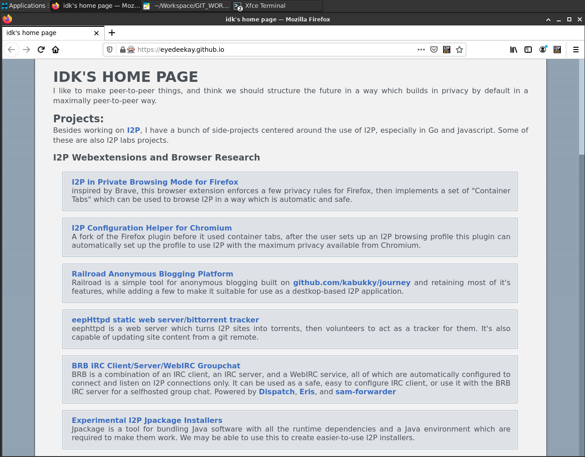

i2psetproxy.js
==============

WebExtension that does extended configuration of a dedicated I2P browser. While
**experimental**, it's capable of enforcing the use of the I2P Proxy without
needing to touch about:config and disables several
fingerprinting/de-anonymization vectors on it's own. It is also the easiest way
to configure an I2P browser on Android without requiring the user to root their
device.

The Old Version
---------------

New versions of this extension create an I2P in Private Browsing mode instead.
Since this is a drastic change to the behavior of the old plugin, a new entry
for the new plugin has been made at a new location on addons.mozilla.org.

 * This is the new version: [[link]](https://addons.mozilla.org/en-US/firefox/addon/i2p-in-private-browsing/)

 * This is the old version: [[link]](https://addons.mozilla.org/en-US/firefox/addon/I2P-Proxy/)

Android usage:
--------------

Open the following link
[Github Releases Version](https://github.com/eyedeekay/i2psetproxy.js/releases/)
in the browser you want to use for I2P. Firefox will warn you that it is about
to install an extension and indicate the permissions required. Read them over
and when you're ready, accept them. That's all it should take, your browser is
now configured to use I2P.

### addons.mozilla.org

If you would prefer to recieve automatic updates from AMO, the correct product
page for this plugin is
[I2P In Private Browsing](https://addons.mozilla.org/en-US/firefox/addon/i2p-in-private-browsing/).
This absolutely requires a working outproxy. If you want to avoid the use of AMO
for updates, you can download the identical plugin from this repository's
releases page. The latest AMO Plugin will always be identical to the latest
github release, except for the version number, which must be incremented for
submission to AMO.

### Features

  * [done] **Provide** a way to launch into an I2P-Specific contextual identity
   (container). Intercept requests to .i2p domains and automatically route them
   to the I2P container. Isolate the router console from other local
   applications by automatically intercepting requests to the router console to
   another container.
  * [done/wip] **Indicate** the I2P browser is in use visually. Find an
   acceptable way to indicate it on Android.
  * [done] **Set** the http proxy to use the local I2P proxy automatically.
   Provide specific configuration for other types of I2P proxies(SOCKS,
   isolating HTTP)
  * [done/wip] **Disable** risky webRTC features/offer the option to re-enable
   them with the proxy enforced.
  * [done] **Change** the color of the browser window to indicate that I2P is in
   use
  * [done-ish] **Reset** the HTTP Proxy tunnel to generate a new destination
   on-demand
   * it does this by working in conjunction with this
    [standalone HTTP proxy](https://github.com/eyedeekay/httptunnel), currently
    disabled*.
  * [ready] **Provide** help in a variety of languages.
  * [wip] **Monitor** the health and readiness of the I2P router it is
   instructed to use. Currently the plugin checks whether the HTTP Proxy is
   working by fetching an image from "http://proxy.i2p" and displaying a result.
   A work-in-progress binding to i2pcontrol is available in ./i2pcontrol, it is
   inert at this time.
  * [1/2] **Handle** router console applications under their own origins and
   within their own contextual identity. (1) The router console is automatically
   confined to it's own container tab. (2) Use a custom protocol handler to
   place each i2p application/plugin under it's own origin, shortening router
   console URL's and placing applications under their own origin.
  * [not started] **Handle Torrents** by talking to i2psnark-rpc plugin and then
   adding them directly into the Firefox downloads drop-downs, menus, etc. If I
   can.

### Screenshot

Super Extra Important Background Info:
--------------------------------------

This plugin's viability is directly related to the viability of Mozilla and
Tor's work on hardening Firefox itself and of particular interest are the
"Uplift" and "Fusion(Firefox Using Onions)" projects.

### Links about Project Uplift

 * https://wiki.mozilla.org/Security/Tor_Uplift
 * https://wiki.mozilla.org/Security/FirstPartyIsolation
 * https://wiki.mozilla.org/Security/Fingerprinting
 * https://wiki.mozilla.org/Security/Fennec%2BTor_Project
 * https://wiki.mozilla.org/Security/Tor_Uplift/Tracking

Project uplift seems to have largely been accomplished?

### Links about Project Fusion

 * https://wiki.mozilla.org/Security/Fusion
 * https://trac.torproject.org/projects/tor/wiki/org/meetings/2018Rome/Notes/FusionProject
 * https://blog.torproject.org/tor-heart-firefox